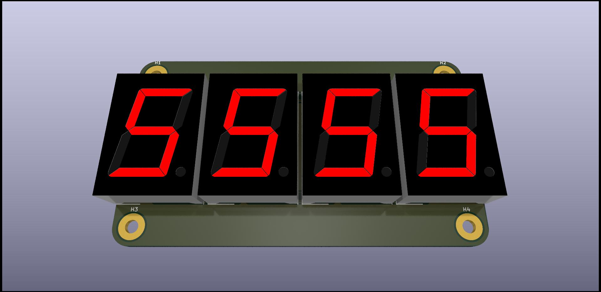

# 1 inch tall 4 digit 7 segment display driven by TM1637 - compact version

These are the Kicad design files for my Hackaday project [Inch Digits](https://hackaday.io/project/169179-inch-digits)

## Versioning

November 2022

## Notes

## Authors

* **Ken Yap**

## License

See the [LICENSE](LICENSE.md) file for license rights and limitations (MIT).
